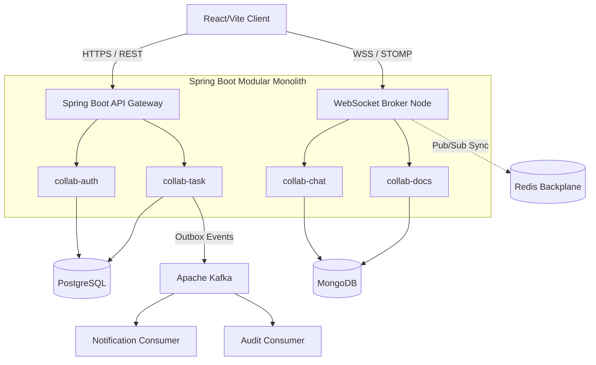
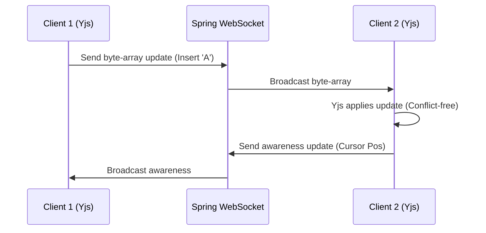
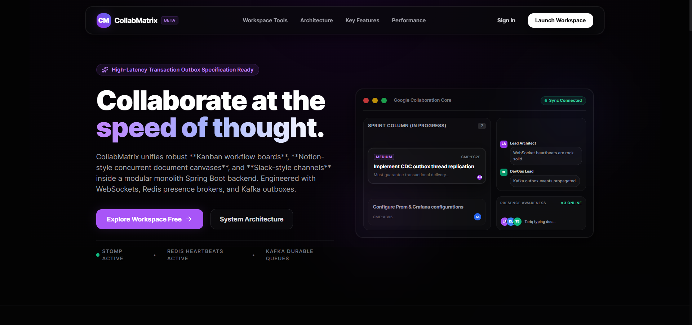
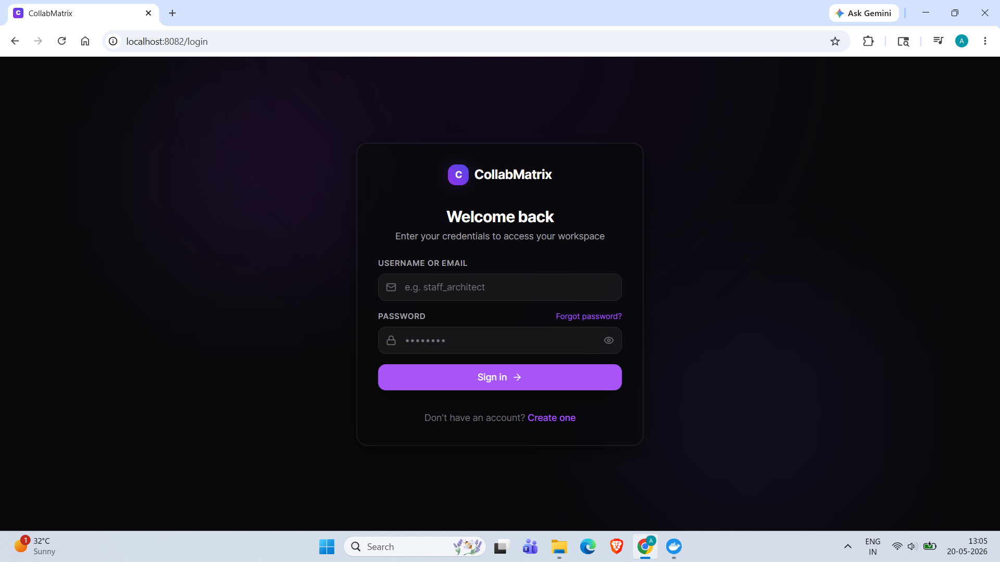
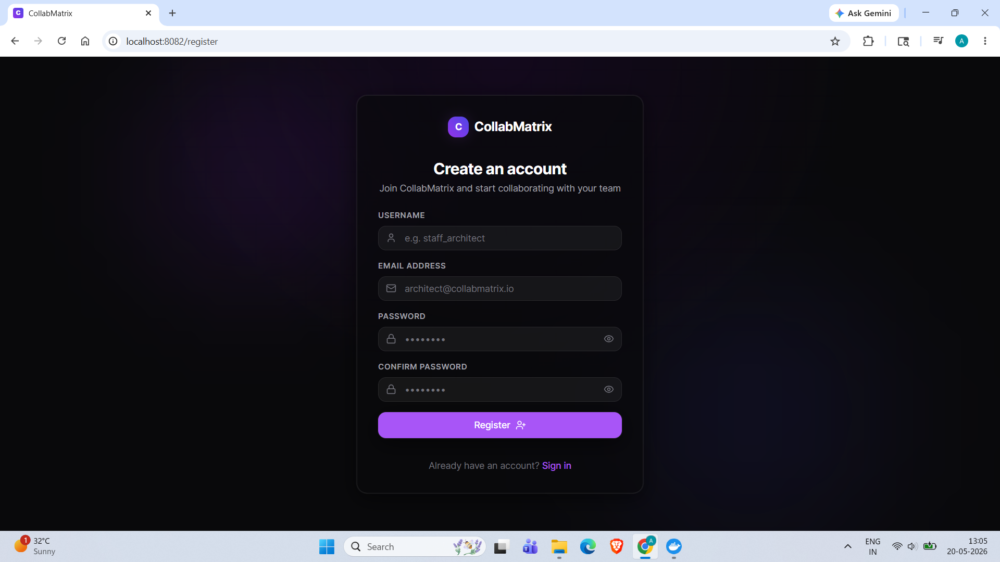
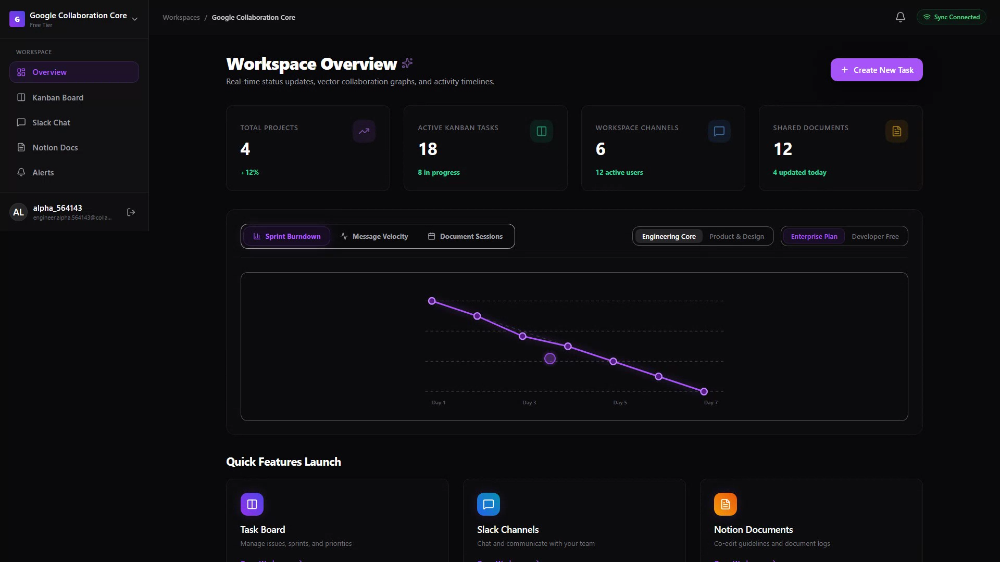
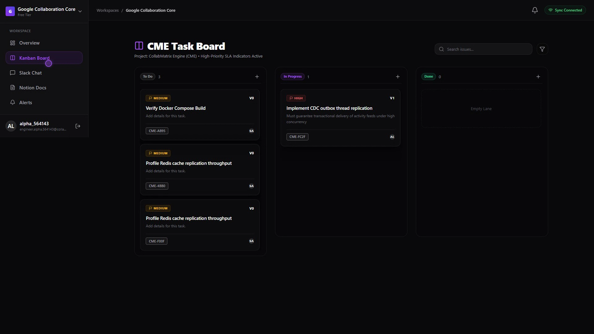
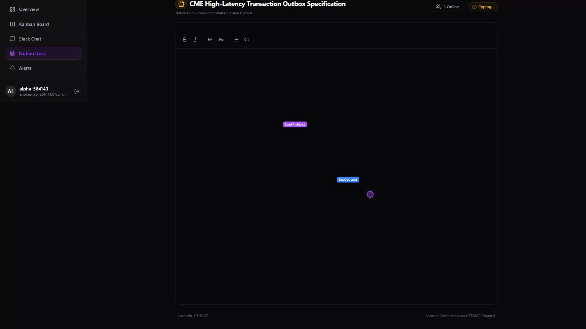
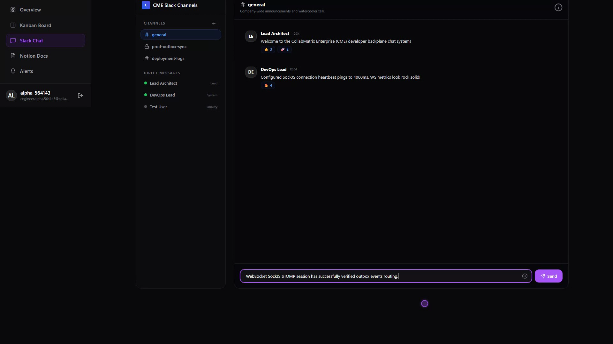

<div align="center">
  
  <h1>CollabMatrix</h1>
  <p><b>Realtime collaboration infrastructure for modern engineering teams.</b></p>
  
  [](#)
  [](#)
  [](#)
  [](#)
  [](#)
  [](#)
  [](#)
  [](#)
  [](#)
  [](#)
  [](#)
</div>

<br/>

---

## 2. PRODUCT OVERVIEW

**CollabMatrix** is an enterprise-grade, high-fidelity real-time collaboration workspace designed to unify the fragmented tools of modern engineering teams. 

It exists to solve context switching. Today’s teams track tasks in Jira, document architecture in Notion, and communicate in Slack. CollabMatrix bridges these silos by combining:
- **Jira-style** rigorous state management and SLA automation.
- **Notion-style** concurrent rich-text document editing.
- **Slack-style** low-latency, threaded messaging and code execution.

Driven by a distributed event architecture and WebSocket synchronization, CollabMatrix ensures that every keystroke, task movement, and message is propagated globally in sub-milliseconds.

---

## 3. CORE FEATURES

> [!TIP]
> **Engineering Value Focus:** Every feature in CollabMatrix is built with scale in mind, utilizing optimal data structures and asynchronous propagation patterns.

*   **Realtime Kanban Boards:** Drag-and-drop task management. *Engineering Value:* Implements optimistic locking (`@Version`) to prevent lost updates during concurrent edits.
*   **Collaborative Rich Text Editing:** Multi-user live editing. *Engineering Value:* Utilizes CRDTs (Conflict-free Replicated Data Types) to resolve distributed edit conflicts without central locking.
*   **Slack-Style Messaging:** Channel-based and direct threaded messaging. *Engineering Value:* Backed by MongoDB for high-throughput, unstructured document appends.
*   **Activity Replay Timeline:** Chronological system audit. *Engineering Value:* Powered by Kafka Change Data Capture (CDC) events streamed asynchronously.
*   **Smart Notifications:** Context-aware alerts. *Engineering Value:* Uses Redis TTL queues to monitor SLA breaches efficiently without heavy database polling.
*   **WebSocket Sync Engine:** Global state synchronization. *Engineering Value:* Horizontally scalable via a Redis Pub/Sub backplane.
*   **Kafka Event Streaming:** Decoupled microservice communication. *Engineering Value:* Ensures eventual consistency and zero data loss using the Transactional Outbox Pattern.
*   **Redis Presence Tracking:** Live user online/offline status. *Engineering Value:* Sub-millisecond read/write capabilities for high-frequency heartbeat pings.
*   **Multi-Tenant Workspaces:** Organizational segregation. *Engineering Value:* Row-level security constructs and strict RBAC controls.

---

## 4. SYSTEM ARCHITECTURE

CollabMatrix utilizes a **Modular Monolith** backend architecture. This provides the deployment simplicity of a monolith while strictly enforcing microservice-level boundaries (domain isolation) to allow seamless extraction into independent microservices as the platform scales.

### High-Level Topology



**Consistency vs. Availability Tradeoffs:** 
CollabMatrix prioritizes *Consistency* (CP) for transactional task states (via Postgres Optimistic Locking) but shifts towards *Availability/Eventual Consistency* (AP) for chat, presence, and notifications (via Redis and Kafka).

---

## 5. TECH STACK

| Layer | Technologies | Purpose |
| :--- | :--- | :--- |
| **Frontend** | React 18, TypeScript, Tailwind CSS, Zustand, Framer Motion, Yjs | High-performance, glassmorphic UI with CRDT-based local-first state resolution. |
| **Backend Core** | Java 17, Spring Boot 3, Spring Security (JWT), Spring Data JPA | Robust, enterprise-grade modular monolith handling REST and WebSocket traffic. |
| **Data / Storage** | PostgreSQL 15, MongoDB 6.0, Redis 7.0 | Polyglot persistence strategy separating transactional, document, and ephemeral data. |
| **Event Streaming** | Apache Kafka, Zookeeper | Async decoupling, CDC, and outbox event streaming. |
| **DevOps / Infra** | Docker, Docker Compose, Nginx, Prometheus, Grafana | Complete containerized orchestration and deep system observability. |

---

## 6. PROJECT STRUCTURE

The repository is strictly organized into domain-driven modules:

```text
collab-matrix/
├── backend/                  # Java 17 Spring Boot Modular Monolith
│   ├── collab-auth/          # Identity, JWT, RBAC & Security definitions
│   ├── collab-task/          # Kanban logic, SLA tracking, JPA Entities
│   ├── collab-chat/          # WebSocket controllers, MongoDB messaging
│   ├── collab-docs/          # Yjs CRDT synchronization handlers
│   ├── collab-events/        # Kafka Producers/Consumers, Outbox pattern
│   └── collab-infra/         # Shared configs (SecurityConfig, ExceptionHandlers)
├── frontend/                 # React 18 SPA
│   ├── src/features/         # Domain-driven feature slices (chat, tasks, docs)
│   ├── src/store/            # Zustand global state (auth, websockets)
│   └── src/layouts/          # Complex UI shells (drawers, sidebars)
└── docker-compose.yml        # Orchestration for the 9-container infrastructure
```

---

## 7. REALTIME ENGINEERING EXPLANATION

Real-time interaction in CollabMatrix is driven by **STOMP over SockJS (WebSockets)**. 

Because WebSocket connections are stateful (bound to a single server instance), scaling out multiple backend nodes requires a synchronization layer. We utilize a **Redis Pub/Sub Backplane**.
1. User A sends a message to Node 1 on `/app/chat.send`.
2. Node 1 persists to MongoDB and publishes the payload to a Redis channel.
3. Node 2 receives the Redis broadcast and pushes it down its established WebSocket connection to User B.

**Presence Tracking:** Clients send a heartbeat ping every 10 seconds. The backend updates a Redis key (`user:presence:{id}`) with a TTL of 15 seconds. If a node crashes or a user loses connection without cleanly disconnecting, the TTL expires automatically, gracefully updating global presence state.

---

## 8. COLLABORATIVE EDITING ENGINE

CollabMatrix implements collaborative text editing using **CRDTs (Conflict-free Replicated Data Types)** via **Yjs**.

Unlike Operational Transformation (OT) which requires a central authoritative server to sequence operations, CRDTs allow mathematical merging of distributed states. 
- **Awareness State:** Yjs awareness protocols handle ephemeral data like cursor positions and selection highlights without persisting them to the database.
- **Auto-save Strategy:** The backend subscribes to the Yjs document updates and periodically debounces snapshots into MongoDB for long-term persistence.



---

## 9. EVENT-DRIVEN ARCHITECTURE

To prevent tight coupling between domains, we utilize **Apache Kafka** implementing the **Transactional Outbox Pattern**.

When a user moves a Kanban task, the `collab-task` module updates PostgreSQL and inserts an event record into an `outbox` table within the same ACID transaction. A background relayer publishes this event to Kafka. 
- **Decoupling:** The `collab-notification` module consumes this event to send WebSocket alerts independently of the HTTP request thread.
- **Resilience:** If the notification service is down, Kafka retains the event. When the service recovers, it resumes processing from its last committed offset.

---

## 10. DATABASE DESIGN

CollabMatrix embraces **Polyglot Persistence**, matching the exact database paradigm to the access pattern.

- **PostgreSQL (Transactional):** Users, Workspaces, and Tasks. We need strict schema validation, ACID transactions, and foreign key constraints to prevent orphaned data.
- **MongoDB (Document):** Chat messages and Document snapshots. Chat applications are incredibly write-heavy and hierarchically nested (threads). Mongo provides the schema flexibility and append-throughput required.
- **Redis (Key-Value/PubSub):** Short-lived, high-read ephemeral data (session states, typing indicators, presence).

---

## 11. SECURITY ARCHITECTURE

- **Stateless Authentication:** JSON Web Tokens (JWT) are verified via asymmetric/symmetric cryptographic signatures at the API Gateway layer, removing session-lookup latency.
- **RBAC (Role-Based Access Control):** All users default to `ROLE_MEMBER`. Privilege escalation to `ROLE_ADMIN` requires direct database manipulation or authorized backend API calls (`@PreAuthorize("hasRole('ADMIN')")`).
- **Data Integrity:** `@Version` annotations in JPA enforce Optimistic Locking, preventing race conditions (e.g., two users assigning the same task simultaneously).

---

## 12. PERFORMANCE & SCALABILITY

- **Frontend Virtualization:** Long chat threads and massive kanban boards utilize DOM virtualization to only render visible items, maintaining a 60fps framerate.
- **Lazy Loading & Code Splitting:** Vite chunks the React application by route, ensuring lightning-fast initial Time-To-Interactive (TTI).
- **Kafka Throughput:** Partitioned Kafka topics allow horizontal scaling of consumer groups, capable of processing tens of thousands of system events per second.

---

## 13. LANDING PAGE & UI PREVIEW

> [!NOTE]
> A full cinematic walkthrough of CollabMatrix is available in the demo video below. Screenshots cover all major UI surfaces.

### 🎬 Demo Video

https://github.com/Arbaz4Sayyad/Collab-Matrix/raw/main/Screenshots/collabmatrix_cinematic_demo.mp4

> *Click the link above to watch the full cinematic demo — or find the file at [`Screenshots/collabmatrix_cinematic_demo.mp4`](./Screenshots/collabmatrix_cinematic_demo.mp4)*

---

### 📸 Screenshots

<details>
<summary><b>🏠 Landing Page</b></summary>



</details>

<details>
<summary><b>🔐 Login & Registration</b></summary>





</details>

<details>
<summary><b>📊 Dashboard</b></summary>



</details>

<details>
<summary><b>📋 Kanban Board</b></summary>



</details>

<details>
<summary><b>📝 Collaborative Docs (Notion-style)</b></summary>



</details>

<details>
<summary><b>💬 Slack-style Chat</b></summary>



</details>

---

## 14. LOCAL DEVELOPMENT SETUP

Get CollabMatrix running on your local machine in under 3 minutes.

### Requirements
- Docker Desktop (Compose v2)
- Node.js 20+
- Java 17

### One-Command Start
The entire infrastructure, backend, and database seeding is orchestrated via Docker Compose.

```bash
git clone https://github.com/Arbaz4Sayyad/Collab-Matrix.git
cd Collab-Matrix

# Build and boot the 9-container infrastructure
docker compose up -d --build
```

### Environment Variables (`frontend/.env`)
```env
VITE_API_URL=http://localhost:8080/api
VITE_WS_URL=http://localhost:8080/ws
```

---

## 15. DOCKER & INFRASTRUCTURE

The `docker-compose.yml` provisions the following stack:
1. `collab-frontend`: Nginx serving the Vite build.
2. `collab-backend`: Spring Boot executable JAR.
3. `collab-postgres`: Relational data.
4. `collab-mongodb`: Document data.
5. `collab-redis`: Caching and Pub/Sub.
6. `collab-zookeeper`: Kafka coordinator.
7. `collab-kafka`: Event broker.
8. `collab-prometheus`: Metrics scraper.
9. `collab-grafana`: Telemetry visualization.

---

## 16. API DOCUMENTATION

### Sample REST Endpoint (Auth)
```http
POST /auth/login
Content-Type: application/json

{
  "username": "staff_architect",
  "password": "SecurePassword123!"
}
```

### WebSocket Topics (STOMP)
- **Subscribe:** `/topic/workspace.{workspaceId}.chat` (Listen for incoming messages)
- **Subscribe:** `/topic/user.{userId}.alerts` (Listen for targeted SLA notifications)
- **Publish:** `/app/chat.send` (Send a message payload)

---

## 17. OBSERVABILITY & MONITORING

CollabMatrix is heavily instrumented using Spring Boot Actuator.
- **Prometheus** scrapes `/actuator/prometheus` every 15 seconds.
- **Grafana** (accessible at `localhost:3000`) provides pre-built dashboards monitoring JVM memory heaps, Kafka consumer lag, HTTP request latency percentiles, and active WebSocket connection counts.

---

## 18. TESTING STRATEGY

- **Backend:** JUnit 5 + Mockito for unit testing business logic. Testcontainers for spinning up disposable Postgres/Kafka instances for integration tests.
- **Frontend:** Vitest + React Testing Library for component unit testing.
- **Load Testing:** Artillery/JMeter scripts to simulate thousands of concurrent WebSocket connections and validate Redis Pub/Sub bottleneck thresholds.

---

## 19. FUTURE ROADMAP

- [ ] **AI Summarization:** Integrate LLMs to auto-summarize long Slack threads.
- [ ] **Collaborative Whiteboard:** Implement an infinite canvas using Fabric.js/TLDraw synced via WebSockets.
- [ ] **Offline Sync Queues:** Utilize Service Workers and IndexedDB to allow full offline operation with optimistic background sync upon reconnection.
- [ ] **Federation Support:** Cross-workspace communication bridging.

---

## 20. RESUME / INTERVIEW VALUE

> [!IMPORTANT]
> **Why this project matters:** CollabMatrix is not a standard CRUD application. It is a serious, production-grade distributed system. 

It heavily demonstrates senior-level engineering concepts:
- **Event-Driven Architecture:** Solving distributed data consistency via Kafka.
- **Concurrency Control:** Handling massive concurrent edits via CRDTs and Optimistic Database Locking.
- **Real-time Scaling:** Bridging stateful WebSockets across stateless backend nodes using a Redis backplane.
- **Polyglot Persistence:** Architecting data models based on highly specific read/write access patterns rather than forcing a single DB.

---

## 21. CONTRIBUTING GUIDE

We welcome contributions from the community!
1. **Fork the repository** and create your branch from `main`.
2. **Branch Naming:** Use `feature/issue-number-description` or `fix/issue-number-description`.
3. **Commit Messages:** Follow Conventional Commits (`feat: added Yjs sync`, `fix: resolved race condition in tasks`).
4. **Pull Requests:** Ensure all TypeScript checks (`npm run build`) and Java tests (`mvn test`) pass before requesting a review.

---

## 22. LICENSE & ACKNOWLEDGEMENTS

Released under the **MIT License**.

Architecture heavily inspired by engineering blogs from [Linear](https://linear.app/method), [Notion](https://www.notion.so/blog), and [Discord](https://discord.com/category/engineering). Kubernetes scaling strategies adapted from Vercel's infrastructure principles.
