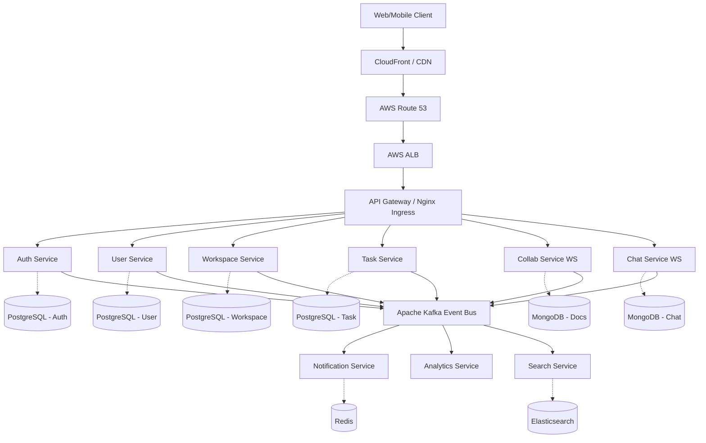
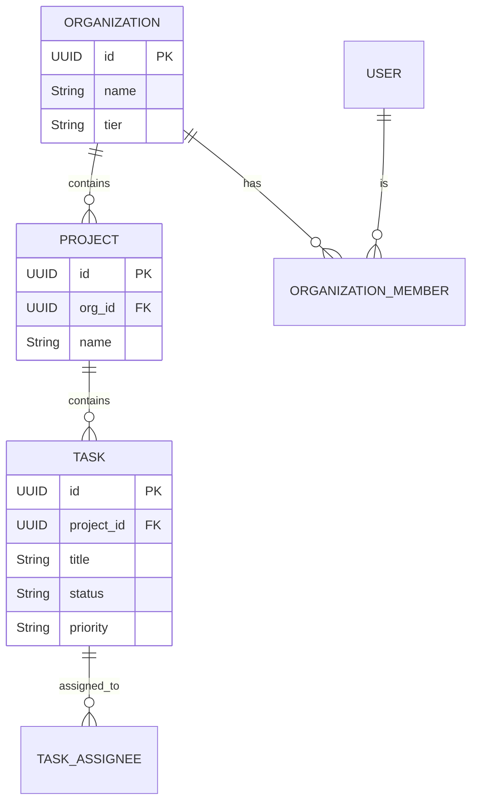

# Complete System Architecture & Design
**CollabMatrix: Real-Time Enterprise Collaboration Platform**

---

## 1. COMPLETE SYSTEM DESIGN

### High-Level Architecture
The platform is designed as a **Microservices-based, Event-Driven Architecture (EDA)** deployed on Kubernetes. 



### Communication Patterns
- **Synchronous (REST/gRPC)**: Used for direct client-to-server operations (e.g., login, fetching task lists, creating workspaces) where immediate response is required. Inter-service sync communication is minimized but handled via Feign Clients/gRPC.
- **Asynchronous (Event-Driven)**: Used for state changes (e.g., `TaskUpdatedEvent`, `UserJoinedEvent`). Services publish to Kafka, and downstream services (Notification, Analytics, Search) consume these events.
- **Real-Time (WebSockets)**: Used for Chat, Live Cursors, and Collaborative Editing.

### Database-Per-Service Strategy
To ensure loose coupling, each domain owns its database.
- **PostgreSQL**: Used for structured, relational, transactional data (Users, Workspaces, Tasks).
- **MongoDB**: Used for unstructured/semi-structured, high-write data (Chat threads, Document snapshots, CRDT states).
- **Redis**: Caching, Session store, WebSockets pub/sub, Presence tracking.

---

## 2. MICROSERVICES LIST

| Service | Responsibilities | DB / Storage | Event Pub/Sub |
|---------|-----------------|--------------|---------------|
| **API Gateway** | Routing, Rate Limiting, TLS Termination, Token Validation. | Redis (Rate limits) | - |
| **Auth Service** | Login, Registration, JWT issuing, OAuth2, Password reset. | PostgreSQL | Pub: `UserRegistered` |
| **User Service** | Profile management, Preferences, User status. | PostgreSQL | Pub: `ProfileUpdated` |
| **Workspace Service** | Org/Project CRUD, RBAC, Team management. | PostgreSQL | Pub: `WorkspaceCreated`, `MemberAdded` |
| **Task Service** | Agile boards, Sprints, Epics, Issue tracking. | PostgreSQL | Pub: `TaskCreated`, `TaskUpdated` |
| **Collab Service** | Real-time doc editing, CRDT sync, Live cursors. | MongoDB | Pub: `DocUpdated` |
| **Chat Service** | DMs, Channels, Threaded replies, Mentions. | MongoDB | Pub: `MessageSent` |
| **Notification Svc** | In-app alerts, Emails, Push Notifications. | Redis / MongoDB | Sub: `*` (Listens to most events) |
| **Search Service** | Global search across tasks, docs, chats. | Elasticsearch | Sub: `Task*`, `Doc*`, `Msg*` |
| **File Service** | Avatar upload, Document attachments. | AWS S3 | Pub: `FileUploaded` |

---

## 3. DATABASE DESIGN

### PostgreSQL Core Schema (Task & Workspace)



### MongoDB Design (Chat & Collaboration)
**Collection: `chat_messages`**
- Optimized for time-series and pagination.
- Fields: `_id`, `channel_id`, `sender_id`, `content`, `mentions[]`, `created_at`.
- Indexing Strategy: Compound index on `{ channel_id: 1, created_at: -1 }`.

**Multi-Tenancy Approach**: 
- **Logical Isolation**: Tenant ID (Organization ID) is injected into every JWT. Every DB table/collection has an `org_id` column. Row-Level Security (RLS) in PostgreSQL enforces tenant isolation at the database level.

---

## 4. REAL-TIME COLLABORATION ENGINE

### Operational Transformation (OT) vs CRDT
We utilize **Conflict-free Replicated Data Types (CRDTs)** via **Yjs**.
- **Why CRDT?** OT requires a central server to order operations (like Google Docs). CRDTs are mathematically proven to achieve eventual consistency without a central coordinator, making it vastly superior for distributed architectures and offline-first capabilities.

### WebSocket Architecture
- Clients connect to the `Collab Service` via WebSockets.
- Because `Collab Service` scales horizontally, clients modifying the *same* document might hit different pods.
- **Solution**: Redis Pub/Sub backplane. 
  - Pod A receives an update from User 1. Pod A applies it and publishes to Redis `doc:123:updates`.
  - Pod B is subscribed to `doc:123:updates`, receives the payload, and pushes it via WebSocket to User 2.

### Presence & Cursors
- Handled statelessly via ephemeral WebSocket broadcasting. Awareness data (cursor X/Y, user color) is broadcasted rapidly but *not* persisted to the database.

---

## 5. SECURITY DESIGN

- **Authentication**: JWT access tokens (short-lived, 15m) and opaque refresh tokens (stored in HttpOnly Secure cookies).
- **Authorization (RBAC)**: Defined via Spring Security `@PreAuthorize("hasPermission(#projectId, 'WRITE_TASK')")`.
- **API Security**: 
  - API Gateway validates the JWT signature statelessly.
  - Rate limiting (e.g., Token Bucket via Redis) applied at the Gateway to prevent DDoS.
- **File Uploads**: Clients request a Pre-signed S3 URL from `File Service`. Clients upload directly to S3 (bypassing our backend bandwidth). S3 triggers an event upon success.

---

## 6. EVENT-DRIVEN ARCHITECTURE (KAFKA)

Using the **Outbox Pattern** to guarantee reliable event publishing.

1. **Transaction**: `Task Service` writes the new Task to PostgreSQL AND writes an event to the `outbox` table in the *same* transaction.
2. **Debezium (CDC)**: Reads the PostgreSQL Write-Ahead Log (WAL), captures the `outbox` insert, and streams it to Kafka.
3. **Consumer**: `Notification Service` consumes the Kafka topic.

### Key Kafka Topics
- `workspace.task.events` (Partitions: 12, Key: ProjectID)
- `workspace.chat.events` (Partitions: 24, Key: ChannelID)

**Resiliency**:
- Dead Letter Queues (DLQ) for failed notification processing.
- Idempotent consumers (using Redis to track processed `event_id`s).

---

## 7. REDIS USAGE

1. **Distributed Caching**: Cache User Profiles, Workspace metadata (`@Cacheable` in Spring).
2. **Rate Limiting**: Used by API Gateway (Redis + Lua scripts).
3. **Presence Tracking**: `SET user:status:123 "ONLINE" EX 60`. If the heartbeat stops, the key expires. Keyspace notifications trigger a "User Offline" Kafka event.
4. **WebSocket Backplane**: Pub/Sub for horizontal scaling of Chat and Collab services.

---

## 8. FRONTEND ARCHITECTURE

```text
src/
├── app/                  # Providers (QueryClient, AuthProvider, Router)
├── entities/             # Types, Models (Task, User, Doc)
├── features/             # Business Logic
│   ├── kanban-board/     # Drag & Drop UI, local state
│   ├── rich-editor/      # ProseMirror / Yjs integration
│   └── chat-sidebar/     # Virtualized lists, socket hooks
├── shared/
│   ├── api/              # Axios instances, React Query hooks
│   ├── ui/               # Generic buttons, inputs, modals (Tailwind + Radix)
│   └── lib/              # Utils, date formatters
└── pages/                # Route definitions
```

**State Strategy**:
- **Zustand**: For ephemeral UI state (e.g., sidebar open, selected theme).
- **React Query**: For server state (fetching tasks, caching, background refetching).
- **Optimistic Updates**: When a user drags a task on the Kanban board, React Query mutates the cache immediately, reverting on API failure.

---

## 9. DEVOPS & CLOUD ARCHITECTURE

- **Docker/K8s**: Every microservice is a Docker container. Kubernetes manages deployments, StatefulSets (for Kafka/Zookeeper), and Services.
- **AWS Deployment**:
  - EKS (Elastic Kubernetes Service) for compute.
  - RDS for PostgreSQL.
  - DocumentDB for MongoDB compatibility.
  - ElastiCache for Redis.
  - MSK for Managed Kafka.
- **CI/CD**: GitHub Actions.
  - On PR: Run unit/integration tests, SonarQube analysis.
  - On Merge to Main: Build Docker image, push to ECR, update Helm chart, trigger ArgoCD for GitOps deployment to EKS.

---

## 10. OBSERVABILITY

- **Logging**: ELK Stack. All microservices output JSON logs. FluentBit deployed as a DaemonSet ships logs to Elasticsearch.
- **Metrics**: Prometheus pulls JVM metrics (Micrometer) and Node metrics. Dashboards built in Grafana.
- **Distributed Tracing**: OpenTelemetry instrumentation. `traceId` and `spanId` are generated at the API Gateway and passed in HTTP headers/Kafka records across the entire system. Traces are visualized in Jaeger/Tempo.

---

## 11. ADVANCED ENGINEERING FEATURES

- **Saga Pattern**: Used for Workspace Deletion. Deleting a workspace requires removing Tasks, Docs, Chats, and Users. Orchestrated via asynchronous Kafka events with compensating transactions if a step fails.
- **CQRS**: The Task Kanban board requires complex joins (assignees, comments, labels, status). We separate the Write model (PostgreSQL) from the Read model (Elasticsearch), updated via Kafka.
- **Bulkheads & Circuit Breakers**: Configured via Resilience4j. If the `Search Service` goes down, the Gateway circuit breaks the search endpoint, returning a graceful degradation response instead of exhausting connection pools.

---

## 12. PERFORMANCE & SCALABILITY

- **Handling 1M+ Users**:
  - **Stateless Auth**: JWT means no session lookups in a DB.
  - **Database Scaling**: Read replicas for PostgreSQL. Sharding MongoDB by `org_id`.
  - **WebSocket Scaling**: Nginx load balances WS connections based on IP Hash. Redis Pub/Sub handles pod-to-pod message routing.
  - **CDN**: CloudFront caches the React SPA and static assets. Pre-signed S3 URLs mean backend servers never handle heavy file IO.

---

## 13. INTERVIEW-LEVEL SYSTEM DESIGN EXPLANATION

**Why PostgreSQL + MongoDB?**
*Tradeoff*: Polyglot persistence introduces operational complexity.
*Reasoning*: Relational databases excel at ACID guarantees needed for RBAC and billing. However, a Jira-style comment thread or Slack-style channel can have massive velocity. MongoDB's document model allows us to embed reactions within a message document, and easily shard collections by `channel_id` to handle write-heavy workloads without table locks.

**CAP Theorem Considerations**
The collaboration engine (CRDTs) leans heavily into **Availability and Partition Tolerance (AP)**. Users must be able to type without latency, even if network partitions occur. The CRDT algorithm guarantees Eventual Consistency.
Conversely, the Workspace/Billing service leans into **Consistency (CP)**. A user's access rights must be strongly consistent.

**Bottlenecks & Limitations**
- WebSocket connections are memory-heavy. JVM tuning and vertical scaling of the Chat pods are necessary.
- Kafka partition key skew: If one Organization is massive (e.g., 50,000 users), hashing by `org_id` for Kafka topics could overload a single partition. *Solution*: Hash by `project_id` or `channel_id` to ensure even distribution.

---

## 15. IMPLEMENTATION ROADMAP

### Phase 1: Core Backend Setup
- Initialize Spring Boot Gateway, Eureka (if local), and Config Server.
- Setup PostgreSQL, Redis, and basic Docker Compose.

### Phase 2: Authentication & RBAC
- Build Auth Service (JWT generation, Spring Security).
- Implement User & Workspace Services (Tenant management).

### Phase 3: Workspace/Project Management
- Build Task Service (CRUD, REST APIs).
- Integrate basic React Frontend with React Query.

### Phase 4: Real-Time Collaboration
- Stand up Collab Service with WebSockets (SockJS/STOMP).
- Integrate Yjs and ProseMirror on the frontend.
- Implement Redis Pub/Sub backplane.

### Phase 5: Kafka Event System
- Deploy Kafka + Zookeeper.
- Implement Outbox pattern using Debezium.
- Refactor inter-service calls from Sync to Async.

### Phase 6: Notifications & Chat
- Build Chat Service (MongoDB, WebSockets).
- Build Notification Service (Email, SSE/WS pushes).

### Phase 7: Monitoring & Observability
- Add Micrometer/Prometheus endpoints to Spring Boot.
- Setup OpenTelemetry distributed tracing.
- Deploy Grafana dashboards.

### Phase 8-10: Cloud, Perf, Hardening
- Containerize all apps. Write Kubernetes Helm charts.
- Implement CI/CD via GitHub Actions.
- Load test with JMeter (Target: 10k concurrent WebSocket connections).
- Configure Rate Limiting, Circuit Breakers, and Auto-scaling (HPA).
